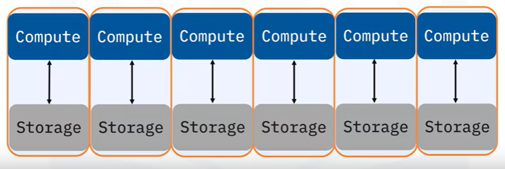
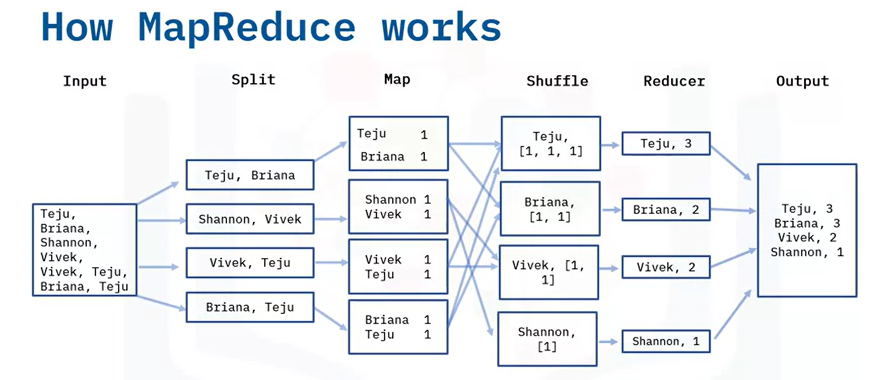
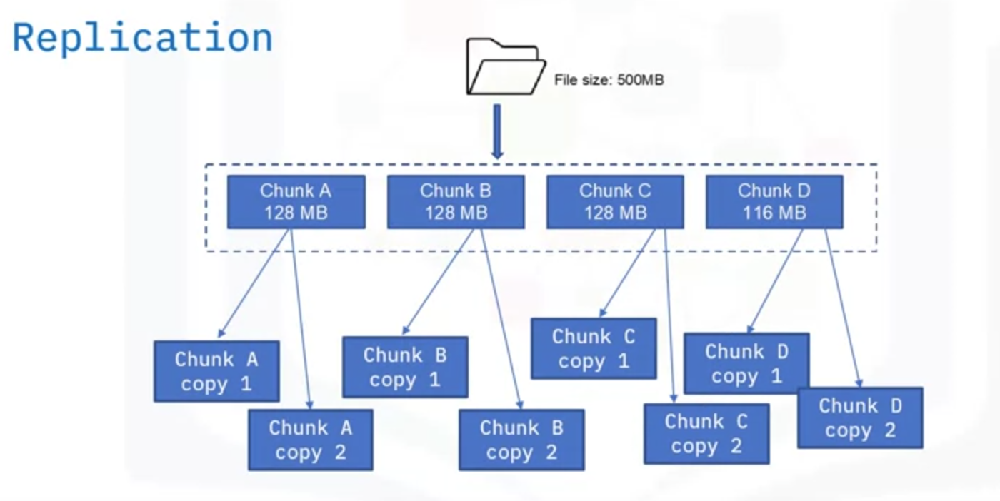

# Relatório de Estudos

Gabriel Faria e Silva

02/08/2024

**Módulos vistos:**

- Linguagens e Frameworks / Python
- Big Data / Frameworks

# Resumo dos módulos

## Big Data

Segundo Bernard Marr, Big Data é o "rastro" que geramos na era digital.

	- Gerado em altos volumes e pode ser dados de diversos tipos: estruturados, semi-estruturados, não estruturados e etc.
	- Para gerar informações precisam ser PROCESSADOS
	- Geralmente distribuídos na nuvem

Big Data porém não é somente uma grande quantidade de dados, mas sim todo o ciclo de obtenção e processamento desses dados

Os dados são coletados de um determinado caso por um framework - Exemplo: Hadoop HDFS. 

Tais dados passam por uma modelagem de dados - Exemplo: Hadoop Map Reduce.

Depois dos dados serem modelados e agrupados, são agora processados por um framework como, por exemplo, o Apache Spark.

Os dados podem ser visualizados em gráficos/charts/etc. com o auxílio de ferramentas de Business Intelligence (BI)

### OS 4 V's DO BIG DATA:

Os dados chegam com uma **VELOCIDADE** muito alta, sendo processados a todo o momento e, por tanto, devem ser processados de forma igualmente rápida a fim de gerar insights dinamicamente.

Além da alta velocidade, chegam em grande **VOLUME**, pois dados são gerados por todos por meio de vários dispositivos.

Nesse ponto entra também a **VARIEDADE**, pois os dados vêm de todas as fontes. Dados variam também em estrutura (podendo serem estruturados, semi e não estruturados) e outros aspectos entre si.

Com o alto volume de dados, muitos podem não possuir **VERACIDADE** nos fatos. Isso é um fator que precisa ser analisado e pode ser influenciado pela fonte/informação do dado.

A correta aplicação dos 4 V's citados gera um quinto V, o **VALOR** resultante da correta aplicação do BIG DATA. 

### PROCESSAMENTO PARALELO / CLUSTERIZAÇÃO

Big Data exige o processamento dos dados em paralelo.

O processamento linear é problemático, pois o problema é solucionado com várias instruções aninhadas e, dessa forma, se uma falhar, o processo inteiro falha junto. Como cada instrução deve esperar a outra ser concluída, também é um processo que demanda mais tempo.

Já o processamento paralelo processa todas as instruções - ou, no caso do Big Data, DADOS - ao mesmo tempo. Dessa forma , caso uma instrução ou um processo falhe, os outros não são interrompidos e continuam funcionando normalmente.  O tempo de processamento também é reduzido pois os dados são processados ao mesmo tempo.

Os dados devem ser processados em vários computadores diferentes portanto, e tal processo denomina-se "Escalamento Horizontal", ou "Clusterização".

### HADOOP

A interface Hadoop é uma série de programas open-source que podem ser usados como frameworks mediadores das operações de Big Data.

- **MapReduce:** "Coração" da interface Hadoop -> processamento de dados através de "computação distribuída", onde diferentes componentes rodam em máquinas diferentes que comunicam-se entre si fitando o mesmo fim. Permite ser programado em diferentes linguagens.

O MapReduce possui o seguinte funcionamento:

Tudo parte de uma input, que são os dados a serem processados. 

Esses dados são separados em um modelo chave-valor (como o dict do python, ou similar a um arquivo JSON). Essa erapa é chamada de 'Map'.

Com os dados separados e mapeados, são agrupados de acordo com um fator em comum e, em seguida, há a etapa de redução 'Reducer', sintetizando os dados agrupados em um único valor final.

Os dados processados são enviados ao HDFS (Hadoop Distributed File System), que é o sistema de armazenamento do Hadoop.

- **HADOOP DISTRIBUTED FILE SYSTEM (HDFS):** Sistema de armazenamento do Hadoop. Divide os dados recebidos no menor valor em que é possível ler / escrever que, dependendo do seu sistema operacional, pode ser 64mb ou 128mb. Esses pequenos 'Chunks' são replicados e transferidos para cada máquina no cluster do HDFS. Dessa forma, se um dos dados for corrompido, há uma cópia salva por segurança.

## Recursos Utilizados
- https://www.coursera.org/specializations/nosql-big-data-and-spark-foundations
- https://medium.com/analytics-vidhya/big-data-an-introduction-b7bc048081c9

## Desafios Encontrados

O curso que busquei (autoria da IBM) é ministrado totalmente em inglês, portanto tive que realizar tradução simultânea do conteúdo.

## Próximos passos
Na próxima etapa pretendo estudar os outros conteúdos do Hadoop e, consequentemente, o Apache Spark, integrando os conhecimentos com Python (pyspark).