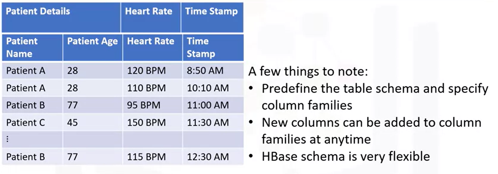
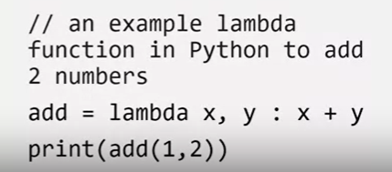

# Relatório de Estudos

Gabriel Faria e Silva

07/08/2024

**Módulos vistos:**

- Big Data / Hive, HBase, Spark
- Linguagens e Frameworks / Python, PySpark

# Resumo dos módulos

## Big Data

### Hive
Hive é um sistema de gerenciamento de banco de dados relacional (RDBMS).

Utilizando um hub docker, o seguinte comando faz o download da imagem do Hive
docker pull apache/hive:4.0.0-alpha-1
        
O seguinte comando roda o docker na porta 10002 com o nome de servidor "myhiveserver"

```
docker run -d -p 10000:10000 -p 10002:10002  --name myhiveserver apache/hive:4.0.0-alpha-1
```
        
Por fim, para finalizar a preparação, o seguinte comando traz o "beeline", um cliente onde é possível fazer manipulações / queries via HiveQL.

```
docker exec -it myhiveserver beeline -u 'jdbc:hive2://localhost:10000/'
```

Utiliza a linguagem HiveQL para queries, que é fundamentalmente baseada em SQL.

Criando tabela em HiveQL:

```
create table Employee(emp_id string, emp_name string, salary  int)  row format delimited fields terminated by ',' ;
```
            
O exemplo acima cria uma tabela chamada "Employee" com três colunas: "emp_id" de tipo string, "emp_name" de tipo string e "salary" de tipo int.

O texto que segue especifica que cada dado é separado por uma vírgula ",", pois, nesse exemplo, os dados foram retirados de um arquivo CSV (Comma-Separated Values).
        
O comando 
```
show tables; 
```
exibe as tabelas criadas até então.

Para importar dados de um determinado arquivo para uma tabela:
```
LOAD DATA INPATH '/hive_custom_data/emp.csv' INTO TABLE Employee;
```           
Nesse caso, extrai os dados do arquivo "emp.csv" e os armazena na tabela "Employee"
        
Para realizar queries, como já dito, é muito semelhante ao SQL convencional
```
SELECT * FROM employee;
```

### HBase
HBase é um sistema de gerenciamento de banco de dados não relacional orientado a coluna.



Através do Hbase é possível criar "famílias de colunas", que são duas ou mais colunas agrupadas
Tomando como base o exemplo acima, as colunas "Pacient name" e "Pacient Age" foram agrupadas em uma única coluna "Patient Details".

### Spark
Apache Spark é um framework open-source para processamento de dados em larga escala (grandes volumes de dados) utilizando computação distribuída.

Computação distribuída segue o mesmo princípio de cluster: Um grupo de computadores operando em processamento paralelo gerando o resultado como se fosse um único sistema ao usuário.
Porém, diferente do "Parallel Processing" (Processamento Paralelo), na computação distribuída cada computador acessa sua memória de forma individual.

#### FUNCIONAL PROGRAMMING



A programação funcional (ou Funtional Programming) é uma metodologia de programação que consiste em focar no "O que" mais do que no "Como fazer", ou seja, busca uma solução mais direta ao problema.

No exemplo dado acima, a função "lambda" é utilizada como uma função anônima para somar dois números de forma direta.

## Linguagens e Frameworks
### Python
O Python é uma linguagem de altíssimo nível comumente utilizada para tratamento de dados / Big Data pelo seu número de APIs e Frameworks disponíveis, bem como sua alta versatibilidade.

[Clique aqui para visualizar o Colab com algumas nocçoes básicas de Python!](https://colab.research.google.com/drive/1zKIOhH_j8s6TU5LUNNBm-C5UpY9dNJPX?usp=sharing)

### PySpark
PySpark é a API Python para Apache Spark. Permite executar processamento e análise de dados em tempo real em um ambiente distribuído.

[Clique aqui para visualizar o Colab contendo exemplos de funcionamento e conceitos do PySpark!](https://colab.research.google.com/drive/1L-TSc-40r_f-lTAYYlzNI-5xJMCsQHAn?usp=sharing)

# Recursos Utilizados
- https://www.coursera.org/learn/introduction-to-big-data-with-spark-hadoop
- https://author.skills.network/courses/599/labs/3151
- https://colab.research.google.com/drive/1lyKBbk8oSVCkofl7KqApgyD5idqPMNMd?usp=sharing


# Desafios Encontrados

O curso que busquei (autoria da IBM) é ministrado totalmente em inglês, portanto tive que realizar tradução simultânea do conteúdo.