# Relatório de Estudos

Gabriel Faria e Silva

09/08/2024

**Módulos vistos:**

- Introdução à Engenharia de Dados / ETL e ELT
- Git

# Resumo dos módulos

## Git
GIT é um sistema de controle de Versionamento de Software **Distribuído** (DVCS).

Cada versão do arquivo é duplicada localmente no PC de cada usuário.

Dessa forma, eles não compartilham a mesma área de trabalho no servidor e, assim, mesmo que o seu amigo esteja desconectado, você ainda assim pode fazer alterações no programa.

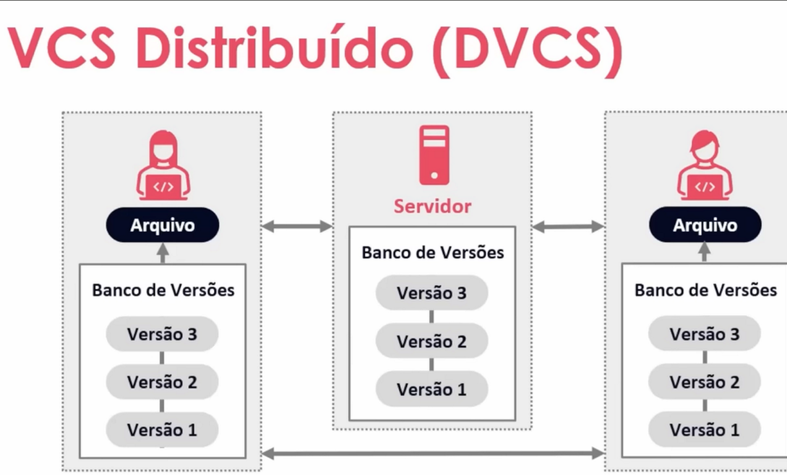

Alguns dos maiores benefícios de um DVCS:
- Cada "clone" é como um backup;
- Possibilita um fluxo de trabalho flexível;
- Possibilidade de trabalhar sem conexão à rede.

O ambiente de trabalho em um DVCS é separado por:
- Ambiente local -> alterações feitas localmente por um PC;
- Ambiente remoto -> local na nuvem / web onde o código é armazenado.

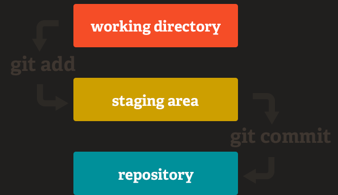

Para passar de um ambiente para outro, são utilizados alguns comandos:

    git add 
    
    //Passa os arquivos do repositório local para um ambiente de "transição" ou "preparação" entre o local e o remoto.

    //Aguarda a mensagem do commit

___

    git commit

    //Avança da área de "transição", aguardando apenas o "git push" para ir ao repositório remoto.

    //-m "mensagem" -> permite adicionar uma mensagem / descrição ao commit.

Fluxo básico no GIT:

Em primeira instância, um repositório remoto é clonado no seu PC, ou seja, no repositório local.

    git clone 
    
    //Clona um repositório remoto

ANTES DE ENVIAR a nova versão por você LOCALMENTE desenvolvida, utilizar o "git pull" para ver se  não foi feita alguma outra alteração

    git pull 
    
    //Junção dos comandos: git fetch e git merge
    //Traz as informações do repositório remoto

O comando "git push" atualiza o repositório remoto com suas alterações feitas no repositório local

    git push 
    
    //OBS: Sempre verificar com o git pull se seu repositório local está sincronizado com o remoto antes de enviar qualquer alteração

___

O comando "git config" mostra todas ações possíveis em um programa
Tem bem mais coisa em baixo, a imagem está cortada

Na parte de "config":
- Global -> se relaciona às configurações de um usuário do PC
- System -> config de todos os usuários de um sistema
- Local -> de um único repositório

___

    git config --global user.name "gabriel faria"
    //O user name no PC agora está configurado como gabriel faria

    git config user.name
    >> gabriel faria    //Output

    git config --global init.defaultBranch main
    //Define a branch padrão inicial para "main"

___

#### Gerenciamento de Branches
Branch é um **ponteiro que aponta para o commit mais recente**.

Caso uma branch seja criada a partir de outra branch, ela passa a apontar para o mesmo commit que a branch superior apontava.

Porém, as **branches trabalham de forma independente**, portanto, se eu adicionar um commit apenas na branch "teste", apenas "teste" passa a apontar para o novo commit.

    git branch

    //Mostra todas as branches do repositório

Alterando de branch atual:

    git checkout nome_da_branch

    git checkout -b nova_branch //Cria uma nova branch e altera pra ela

#### GitFlow
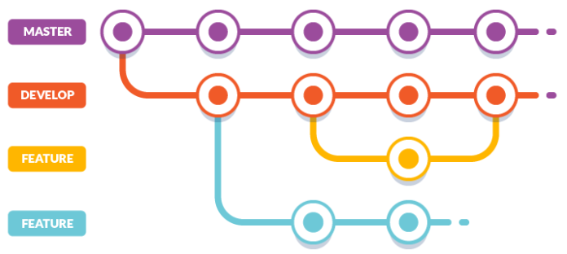

O GitFlow é um sistema de gerenciamento de branches que consiste maiormente nas principais:

- Master / Main: código disponível para o cliente / todos;
- Develop: código ainda em produção. Quando o código da develop fica pronto para ser disponibilizado ao público, é subido para a main;
- Features: implementação única em desenvolvimento contínuo. Quando uma feature fica pronta, é subida para a develop.

## Introdução à Engenharia de Dados
### ETL

ETL é a sigla para **Extract, Transform, Load** e respresenta o processo automatizado de obtenção, processamento e entrega (carregamento) de dados.

#### Extract
Consiste em configurar o acesso aos dados e trazê-los (lê-los) à aplicação.

Pode ser realizado pelo método chamado "Web Scrapping", onde os dados são retirados de sites via APIs, por exemplo.

Métodos para extração de dados:

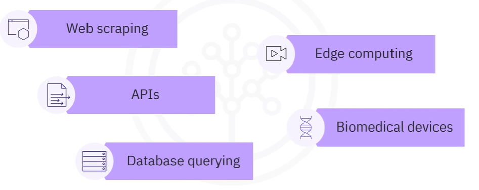

Fontes possíveis para extração de dados:

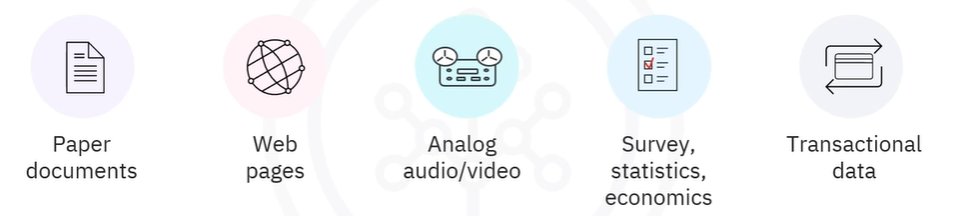
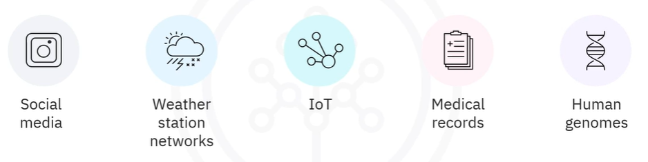

#### Transform
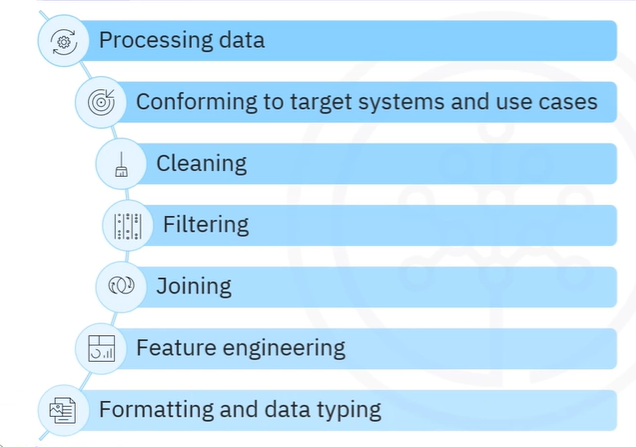

Os dados devem ser processados, tratados e transformados de acordo com o "público alvo" ao qual os dados estão direcionados.

- Tratamento de erros e valores ausentes, por exemplo, seriam exemplos de **limpeza** ocorrendo nos dados. 

- Podem ser **filtrados**, selecionando assim apenas os dados necessários para determinado fim.

- Dados relacionados podem ser **agrupados** (JOIN do SQL).

- A criação de KPIs (Key Performance Indicators) para análise / machine learning, extraindo valores dos dados (recursos), caracteriza a etapa de **engenharia de recursos**.

- Por fim, os dados são **formatados** para serem compatíveis com sua destinação final.

#### Load
Os dados nessa etapa são enfim carregados ao ambiente desejado / destino final, que podem ser: Banco de Dados, Data Warehouse, Data Mart, etc.

O primeiro carregamento de dados em um ambiente é denominado "Full Loading", e é sucedido pelo "Incrementeal Loading", onde o dado inicial é alterado e, por conta disto, necessita ser atualizado.

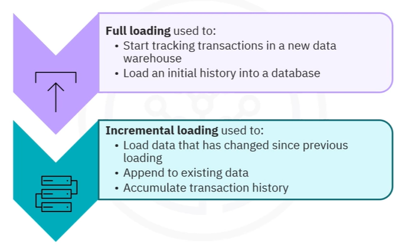

Existem dois tipos de "Incremental Loading":

- **Stream Loading**, onde os dado são atualizados de forma contínua em tempo real;
- **Batch Loading**, onde os dados são atualizados em lotes de tempo em tempo.

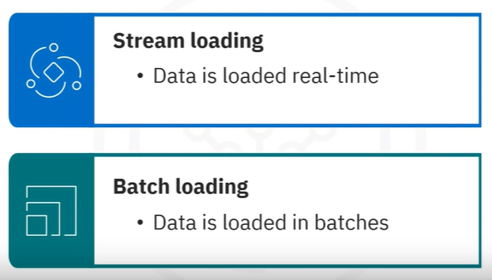

No tocante às metodologias de carregamento de dados, existem os métodos Pull e Push:

- **Pull**, como seu nome sugere, traz os dados da fonte para o Data Warehouse em lotes, em períodos agendados.
- Já no **Push** os dados são enviados continuamente, em tempo real, diretamente da fonte dos dados.

É perceptível, portanto, que o Pull é muito mais indicado para a metodologia de carregamento "Batch Loading" pelos dados virem em lotes em períodos pré-programados. Assim como "Push" é indicado para "Stream Loading" pelos dados serem enviados continuamente.

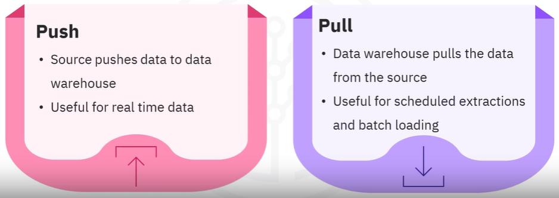

### ELT
A metodologia ELT é uma alternativa ao seu predecessor ETL, porém, como seu próprio nome indica, o processo de "Load", ou seja, carregamento dos dados, acontece antes da transformação dos mesmos.

Dessa forma os dados são armazenados em sua **forma bruta** e são transformados no **ambiente em que são armazenados**, o que permite tempos de carregamento mais rápidos.

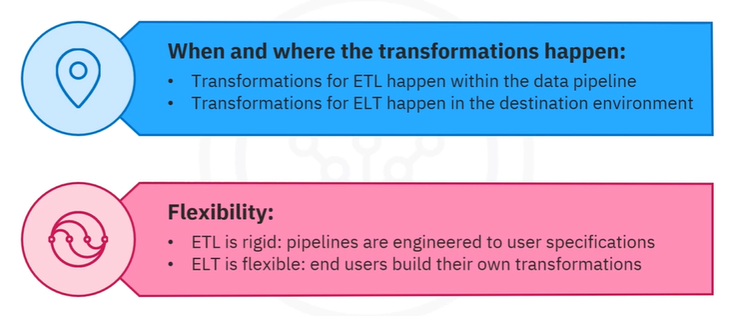

ELT também soluciona problemas de escalabilidade, conseguindo manipular tando dados estruturados quanto não-estruturados na nuvem.

# Recursos Utilizados
- https://www.coursera.org/learn/etl-and-data-pipelines-shell-airflow-kafka
- https://www.dio.me/courses/introducao-ao-git-e-ao-github