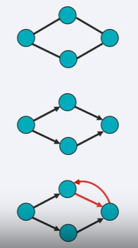
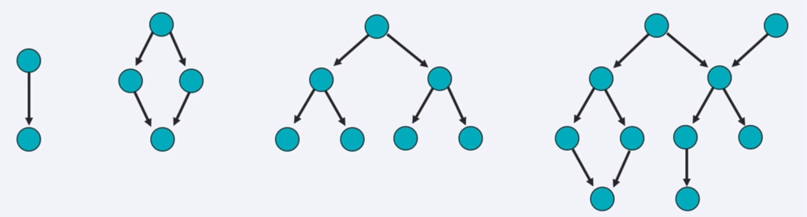
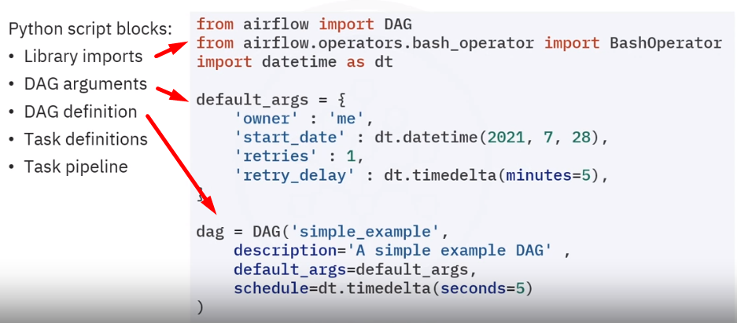
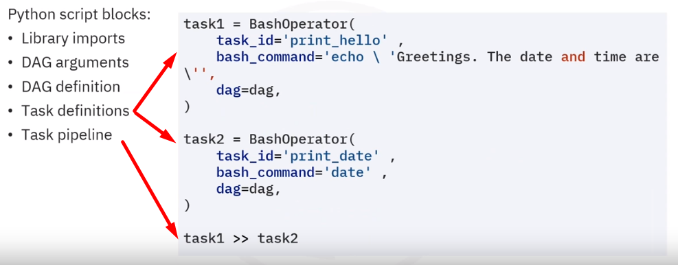
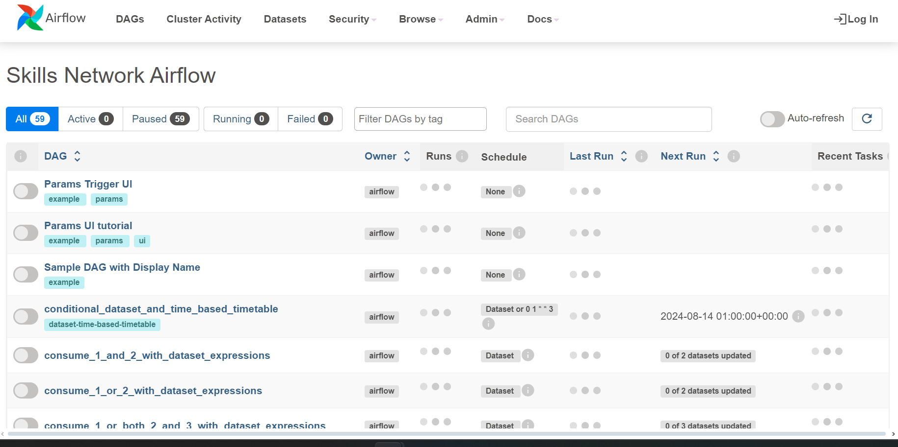
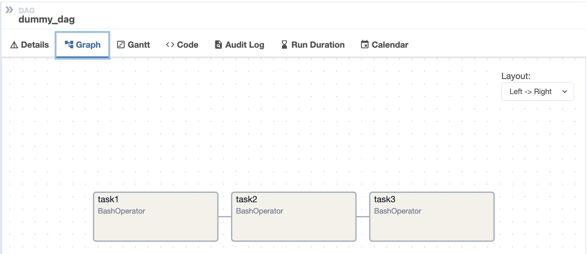

# Relatório de Estudos

Gabriel Faria e Silva

14/08/2024

**Módulos vistos:**

- Linux / Shell
- Linguagens e Frameworks / Apache Airflow

# Resumo dos módulos

## Linux / Shell
Shell é uma interface de usuário para sistemas operacionais baseados em Unix. Pode interpretar comandos e executar outros programas, acessar arquivos, utilidades, aplicações e etc. É uma linguagem de "script" interativa.

Comandos Linux Shell são usados para navegar e trabalhar com arquivos e diretórios.

### Bash
Bash é um interpretador de comandos para Shell e Bash Script é um arquivo de texto escrito utilizando comandos Bash. O caractere "$" precedendo comandos indica o prompt de linha de comando Bash.

#### Bash Script
Tenhamos um Bash Script de nome **myscript** que contenha o seguinte conteúdo:

    echo "Hello World!"

    //Um dos comandos mais básicos de toda a linguagem é aquele que imprime (printa) algo na tela. No script shell, isso é possível pelo comando "echo".

Existem duas formas de executar um arquivo Bash Script. A primeira forma é passar o nome do arquivo como um parâmetro do executável **bash**.

    $ bash myscript
    >> Hello World! //Output

A segunda forma é modificar o nível de acesso do arquivo, o transformando em um executável por si só:
 
    //Altera a permissão de arquivos -> '+': adição de permissões; 'x': execução.
    $ chmod +x ./myscript

    //Executa o arquivo
    $ ./myscript

#### Shebang header
Apesar de o Bash por si só ser um interpretador de comandos, um Bash Script pode ser executado por outros interpretadores instalados no PC do usuário.

A definição de qual vai ser o interpretador utilizado se dá na primeira linha do Script, chamada de **Script Header** ou **Shebang**.

Um **Shebang** inicia com o caractere "#":

    #!/usr/bin/bash

    //Diz para o sistema utilizar o interpretador localizado no caminho /usr/bin/bash

Dessa forma, é possível executar um Script em diversas linguagens de programação, desde que seus respectivo interpretadores estejam instalados na máquina do usuário.

#### Variáveis
A declaração de uma variável segue o padrão:

    NOME_DA_VARIAVEL=valor

E para referenciar a variável no código:

    echo $NOME_DA_VARIAVEL

    //De exemplo, printa o valor contido na variável

#### Manipulação de Strings
É possível manipular Strings via **Expansão de Parâmetros**, dada pela sintaxe:

    ${NOME_DA_VARIAVEL parametro parametro}

Os dois parâmetros subsequentes alteram o valor da variável passada, por exemplo:

    MSG="aBcDeF"

    echo ${MSG^^}

    >> ABCDEF //Output

O comando acima, por conta dos dois "^", transforma todos os caracteres da variável "MSG" em letra maiúscula.

Da mesma forma, é possível transformar todos os caracteres em letra minúscula:

    echo ${MSG,,}

    >> abcdef //Output

Para trocar palavras utilizar "/":

    MSG="Say hi to Chris and Sidney"

    echo ${MSG//Chris/Billy}

    >> Say hi to Billy and Sidney //Output

Mesmo caso, utilizando expressões regulares:

    MSG="I need 10"

    echo ${MSG//[a-zA-Z]/X}

    >> X XXXX 10 //Output

No exemplo acima, todas as letras em minúsculo (a-z) e em maiúsculo (A-Z), ou seja, todas as letras no geral, são trocadas pelo caractere "X".

É possível extrair substrings a partir de uma string utilizando dois pontos ":", similar ao *slicing* do python:

    MSG="God of War"
    echo ${MSG:4}

    >> of War //Output

    echo ${MSG:4:2} //Retorna 2 caracteres a partir do index 4

    >> of //Output

    echo ${MSG#God} //Retorna tudo a partir de "God"

    >> of War //Output

    echo ${MSG%of War} //Retorna tudo antes de "of War"

    >> God //Output
___

#### Coleções
##### Array
Um array é uma coleção onde seus valores são acessados pelo seus respectivos índices (index). É declarado com a seguinte sintaxe:

    my_array=('A','B','C')

Para adicionar um elemento ao array:

    my_array+=('D')

E para remover um elemento:

    unset my_array[3]

Para printar um elemento do array:

    echo ${my_array[0]} //Printa o primeiro elemento
    echo ${my_array[@]} //Printa todos os elementos

    echo ${#my_array[@]} //Printa a quatidade de elementos do array

##### Map
Map é uma coleção de elementos organizados em conjuntos chave-valor, onde para acessar um valor, é preciso referenciar sua respectiva chave, como um *dict* em python.

A declaração segue a sintaxe:

    declare -A <nome_do_map>

Exemplo de declaração + adição de itens ao map:

    declare -A score
    score[alex]="1"
    score[edson]="2"
    score[sebi]="3"
    score[chris]="4"

    unset score[chris] //Removendo elemento "chris"

Mostrando as chaves do map:

    echo ${!score[@]}

Printando os valores:

    echo ${score[@]} //Printa todos os valores
    echo ${score[edson]} //Printa o valor da chave "edson"
    echo ${#score[@]} //Printa a quantidade de elementos

#### Funções
As funções são utilizadas para aproveitar código que será reutilizado, seguindo o funcionamento padrão de qualquer outra linguagem

    #!/usr/bin/env bash //Shebang header

    //Declarando da função:
    printmessages() { 
        echo "Eu sou a mensagem 1"
        echo "Eu sou a mensagem 2"
    }

    //Chamando a função:
    printmessages
    EOF

É possível também passar argumentos adicionais. A detecção dos argumentos é dada pelo caractere "$" precedido do número da posição do argumento.

Por exemplo, "$1" irá se referir ao primeiro argumento passado. "$2" ao segundo e assim por diante:

    #!/usr/bin/env bash

    chelloworld() {
        echo "Hello World from $1"
    }

    helloworld "Alex"
    EOF

    >> Hello World from Alex //Output

#### Condicionais
Uma condicional *if, then, else* em shell tem a seguinte sintaxe:

    if [<statement>]; then
        <consequence statement(s)>
    else
        <consequence statement(s)>
    fi

Exemplo utilizando a função **$RANDOM**, que retorna um número aleatório. O comando **expr** valida uma expressão:

    //Salva um número aleatório e em seguida o printa
    mynum=$RANDOM
    echo $mynum

    //Se o número, quando divido por 2, resultar em 0:
    if [ $(expr $mynum % 2) == "0" ]; then
        echo par //Printa par
    else
        echo impar //Se não, printa ímpar
    fi

#### Loops
É possível utilizar loops pelo recurso **Range**, onde um **for** itera em um alcançe de inteiros:

    for i in {1..5}; do
        echo "Hello World $i"
    done

O mesmo é possível em um array, map e até mesmo em diretórios do sistema

    //Retorna todos os subdiretórios do diretório "var"
    for i in /var/*; do
        echo $(basename "$i")
    done

Similarmente existe o **while**, que itera em loop até que uma certa condicional seja verdadeira:

    x=1;
    while [ $x -le 5 ]; do     //-le -> menor ou igual
        echo "Hello World"
        ((x=x+1))
    done

### Shell em uma pipeline ETL
#### Extraindo dados via comando cut
    echo database
    >> database //Output

É possível extrair caracteres ou campos específicos de uma linha de texto pelo comando de filtro "cut", junto com o "echo":

    echo database | cut -c1-4
    >> data //Output

No exemplo acima, foi passado como parâmetro ao comando "cut" que somente os caracteres de 1 a 4 de "database" (printado pelo comando "echo") seriam printados na tela.

O mesmo pode ser feito para extrair os caracteres de 5 a 8, por exemplo:

    echo database | cut -c5-8
    >> base //Output

E também para extrair caracteres não-contínuos, usando uma vírgula ",":

    echo database | cut -c1,5
    >> db //Output

Até agora apenas caracteres específicos foram selecionados, porém, o mesmo pode ser feito com colunas / campos de um arquivo.

O comando cut aceita outros dois argumentos:
- -d"delimitador" -> especifica o tipo de delimitador de campos em um arquivo. Por exemplo: se um arquivo tem informações separadas por uma vírgula "," (como em um arquivo CSV), no lugar do delimitador, a vírgula "," seria passada como argumento.
- -fx -> onde "x" é o número de campos (colunas) a serem trazidos. Por exemplo, se quiser extrair apenas a primeira coluna do arquivo, o parâmetro será "f1".

O arquivo "passwd" é um dataset de exemplo que contém 6 colunas, delimitadas cada uma por dois pontos ":".

_OBS: o arquivo "passwd" localizado na pasta "/etc" é só um exemplo que estava no curso que fiz. No lugar poderia estar qualquer outro arquivo._

    cut -d":" -f1 /etc/passwd //Traz a primeira coluna do dataset que tem por delimitador ":"
    >> root
       daemon
       bin
       sys
       sync
       games
       man
       lp
       mail
       news
       uucp
       ...
    
Extraindo várias colunas do mesmo dataset:

    cut -d":" -f1,3,6 /etc/passwd //Traz as colunas 1,3,6 do dataset
    >> root:0:/root
       daemon:1:/usr/sbin
       bin:2:/bin
       sys:3:/dev
       sync:4:/bin
       games:5:/usr/games
       man:6:/var/cache/man
       lp:7:/var/spool/lpd
       mail:8:/var/mail
       news:9:/var/spool/news
       uucp:10:/var/spool/uucp
       ...

## Apache Airflow
Airflow é uma plataforma para programaticamente criar, agendar e monitorar workflows. Utiliza **Python** puro, possui uma interface de usuário intuitiva e é uma plataforma open-source.

### Directed Acyclic Graph (DAG)
Um DAG é um tipo especial de grafo. Um grafo por si só é um agrupamento de nós (nodes, representados por círculos) interconectados por linhas denominadas "edges" (ver primeiro grafo da imagem abaixo).

Um grafo direcionado (Directed Graph) é um grafo onde suas linhas tem direção, ou seja, um nó inicial está diretamente conectado a outro, de acordo com a direção da linha (edge) (ver segundo grafo da imagem abaixo).

E por fim, a parte acíclica (Acyclic) se dá pela impossiblidade de haver loops, ou seja, um nó não pode estar conectado com outro em looping (exemplo: terceiro grafo da imagem abaixo).

As Dags podem ser representadas de diversas formas, inclusive na forma de árvore, onde vários nós surgem de um único nó em comum:

(O DAG localizado no centro da imagem acima é um exemplo de um DAG em árvore).

No Apache Airflow os DAGs representam Workflows e Pipelines, onde cada **tarefa é um nó** específico e **cada linha (edge) são dependências entre as tarefas**.

As DAGs no Airflow são scripts em Python que seguem a seguinte estrutura:

A princípio as bibliotecas e e os operadores necessários são importados, seguidos dos argumentos que serão compartilhados nas DAGs do sistema.

Depois que os argumentos das DAGs foram definidos, as DAGs em si são declaradas.

Em seguida as tasks são definidas (nesse exemplo são operadores Bash) e inseridas na pipeline.

A task1 e a task2 seriam os nós do DAG, e a task1 está direcionada para a task2, ou seja, a task2 não acontece sem a task1 acontecer primeiro.

### Operadores Airflow para definição de Tasks
- BashOperator -> executa comandos Bash
  
- PythonOperator -> chama uma função Python

- EmailOperator -> envia um email

- EmptyOperator -> Operador que não faz nada

- GenericTransfer -> Move dados de um database para outro

- LatestOnlyOperator -> Pula tarefas que não estejam rodando durante o intervalo agendado mais recente

- TriggerDagRunOperator -> Aciona um DAG para um **dag_id** específico.

### Argumentos para definição de DAGs
    default_args = {
        'owner': 'Your name',
        'start_date': days_ago(0),
        'email': ['youemail@somemail.com'],
        'retries': 1,
        'retry_delay': timedelta(minutes=5),
    }

- owner -> nome do propietário

- start_date -> Quando o DAG deve rodar de: *days_ago(dias)*

- email -> o email em que os alertas serão enviados

- retries -> o número de novas tentativas em caso de erro

- retry_delay -> o tempo de delay entre novas tentativas

Existem muitos outros argumentos, que [podem ser acessados aqui!](https://www.coursera.org/learn/etl-and-data-pipelines-shell-airflow-kafka/ungradedWidget/WCYd6/reading-dag-structure-and-operators)

### Definindo um DAG
    dag = DAG(
        dag_id='unique_id_for_DAG',
        default_args=default_args,
        description='A simple description of what the DAG does',
        schedule_interval=timedelta(days=1),
    )

Nessa etapa, uma variável chamada *dag* é criada, onde um objeto da **classe DAG** é instanciado com os parâmetros:

- dag_id -> id único. É por esse ID que é possível ativar um DAG com o operador *TriggerDagRunOperator*

- default_args -> aqui é passado o dicionário **default_args**, onde todos os argumentos padrão são definidos.

- description -> uma breve descrição sobre o que o DAG faz

- schedule_interval -> o quão frequentemente o DAG roda. No caso do exemplo acima, roda todo dia (days=1)

### Definindo tasks
    # Define uma task com BashOperator
    task1 = BashOperator(
        task_id='unique_task_id',
        bash_command='<some bashcommand>',
        dag=dag,
    )

    # Define uma task com PythonOperator
    task2 = PythonOperator(
        task_id='bash_task',
        python_callable=<the python function to be called>,
        dag=dag,
    )

    # Define uma task com EmailOperator
    task3 = EmailOperator(
        task_id='mail_task',
        to='recipient@example.com',
        subject='Airflow Email Operator example',
        html_content='
This is a test email sent from Airflow.
',
        dag=dag,
    )

Todas as tasks devem possuir:

- task_id -> string que ajuda a identificar a task

- dag -> O DAG a que essa task pertence

- **A real tarefa a ser realizada**

**A tarefa muda de operador para operador**. Por exemplo, na primeira task, que instanciou um operador Bash (*BashOperator*), a tarefa é um **bash_command**, ou seja, o comando bash a ser realizado.

Já no caso da segunda task, que instanciou um operador Python (*PythonOperator*) a tarefa se dá po um **python_callable**, ou seja, uma função python a ser chamada.

O mesmo se dá no caso da terceira task, que recebe um **assunto, email do destinatário e conteúdo do email em html**.

### Airflow UI

O Airflow possui uma interface de usúario, onde é possível gerenciar e monitorar os DAGs existentes, pausá-los pelo botão ao lado do nome do DAG, visualizar os DAGs em forma de grafos, etc.

# Recursos utilizados
- https://www.coursera.org/learn/etl-and-data-pipelines-shell-airflow-kafka
- https://developers.redhat.com/cheat-sheets/bash-shell-cheat-sheet