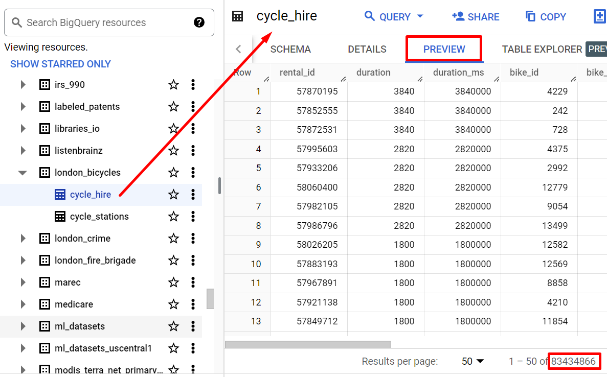

# Relatório de Estudos

Gabriel Faria e Silva

20/08/2024

**Módulos vistos:**

- Análise de dados / Pandas
- Analítico / BigQuery
- CI/CD
- Mensageria / Pub/Sub

# Resumo dos módulos

## Análise de dados
"Análise de dados é o processo de aplicação de técnicas estatísticas e lógicas para avaliar informações obtidas a partir de determinados processos." - [Zendesk](https://www.zendesk.com.br/blog/tipos-analise-de-dados/)

Existem diversos tipos de análises de dados que utilizam diversos tipos de ferramentas como auxílio. Dentre os principais tipos estão:

### Análise Descritiva
A análise descritiva é um tipo de análise baseado em fatos e resultados obtidos que, como o próprio nome indica, são descritos, exibidos e por fim analisados.

São exemplos de análise descritiva relatórios, avaliação de resultados e entre outros.

### Análise Preditiva
Atualmente o tipo mais popular de análise de dados, esse tipo de análise tem como principal foco **prever** cenários futuros com base na análise prévia de padrões identificados de resultados contidos na base de dados.

É nesse viés em que recursos como Machine Learning, Inteligêcia Artifical, redes neurais, e entre outros tornam-se fulcrais para a análise dos dados, pois tais serão treinados com os **padrões** identificados e análisados e, por fim, realizarão previsões dos cenários futuros.

### Análise Prescritiva
A análise prescritiva está intrinsecamente ligada à análise preditiva, sendo o passo posterior a essa.

Uma prescrição pode ser definida como medidas a serem tomadas baseadas em uma previsão. Trazendo esse conceito, portanto, para a análise de dados, após padrões serem análisados e a previsão dos dados ser concluída, medidas de como agir baseadas nas previsões serão tomadas.

**Algoritmos de Machine Learning, IA e entre outros** também terão papel fulcral nesse tipo de análise, pois está sempre condicionada a previsões e predições.

### Análise Diagnóstica
A análise diagnóstica segue o mesmo princípio da descritiva: é concentrada em resultados anteriores. Porém, nesse caso, os dados são analizados com o objetivo de encontrar relações de causa e efeito entre os dados e os resultados.

### PANDAS
Pandas é uma biblioteca de Python para **manipulação e análise de dados**.

[Para mais conhecimento dessa feramenta, clique aqui para visualizar o Notebook!](../labs/Pandas.ipynb)

## BigQuery
"O BigQuery é um data warehouse corporativo totalmente gerenciado que ajuda a gerenciar e analisar dados com recursos integrados, como aprendizado de máquina, análise geoespacial e business intelligence." - [Google](https://cloud.google.com/bigquery/docs/introduction?hl=pt-br)

A arquitetura principal do BigQuery é consistida em duas partes principais: uma camada de armazenamento e otimização de dados e uma camada de computação que fornece recursos de análise de dados.

A arquitetura sem servidor do BigQuery permite consultar quantidades enormes de dados via SQL.

___

Para acessar a ferramentado BigQuery, na interface do GCP (Google Cloud Platform), abra o menu de navegação e clique no ícone "BigQuery".

No BigQuery, `projetos contém datasets, datasets contem tabelas`, ou seja:

    projetos >> datasets >> tabelas

Na primeira seção destacada na imagem acima, à esquerda, temos o menu de navegação das ferramentas disponíveis.

Na segunda seção, há o explorador de projetos, datasets e tabelas presentes na sessão do BigQuery. É possível adicionar projetos pelo botão **ADD** no canto superior direito da seção.

Por fim, na terceira seção da plataforma, é possível criar uma nova query - ou seja, uma consulta em SQL na tabela contida na segunda seção já apresentada - ou navegar pelas queries já existentes. É possível também visualizar um preview de uma tabela e suas informações, como número de colunas, linhas e etc.

_Exemplo de preview de uma tabela. O canto inferior direito exibe o número de linhas._

Como já mencionado, o BigQuery se destaca por realizar consultas em datasets contendo até petabytes via SQL com certa facilidade. Segue exemplo abaixo de uma consulta simples:

Clicando em **SAVE RESULTS**, na aba superior da query realizada, é possível salvar o resultado da query em um arquivo CSV, JSON, planilha Google Sheets e etc.

Selecionar o tipo de arquivo realizará um download na sua máquina. É possível depois subir esse arquivo para um bucket no Cloud Storage (armazenamento em nuvem) da própria Google.

## CI/CD
Continuous Integration / Continuous Delivery / Deploy (CI/CD) é uma é uma prática de desenvolvimento de software que aplica automação e monitoramento contínuos ao ciclo de vida das aplicações.

### Continuous Integration (CI)
Em um time grande, onde todos trabalham em uma mesma aplicação, é comum que hajam muitas ramificações simultâneas e conflitantes da mesma. Portanto, a ideia de Integração Contínua surge com o fito de minimizar os conflitos resultantes de uma situação como esta.

Após o desenvolvedor consolidar mudanças no código da aplicação, tais mudanças passam por **diversos testes automáticos de unidade e integração** para garantir que não danificaram o funcionamento da aplicação. Para isso são testados desde as classes até os módulos que formam a aplicação como um todo.

Dessa forma, torna-se mais fácil detectar e, consequentemente, resolver bugs relacionados a uma mudança no código.

### Continuous Delivery / Continuous Deploy (CD)
A parte de CD é divida em duas partes:
- Enrega contínua
- Implantação contínua

#### Entrega Contínua
Após a verificação de bugs via testes ocorrer na Integração Contínua (CI), a etapa de Entrega Contínua será encarregada de subir essas modificações para um repositório, por exemplo, no GitHub.

#### Implantação Contínua
Por fim, como última etapa de uma pipeline de CI/CD, há a Implementação Contínua. Se todas as mudanças passaram pelo processo de CI e de Entrega Contínua, portanto, elas podem ser liberadas para o uso do cliente. 

A Implementação Contínua permite entregar uma aplicação / atualização ao cliente de forma mais rápida e eficiente, possibilitando feedbacks com maior frequência. Porém, como não há interferência manual no estágio final do pipeline antes da entrada em produção, a implantação contínua é altamente dependente de uma automação bem desenvolvida dos testes.

## Mensageria
“Mensageria é um conceito que define que sistemas distribuídos, possam se comunicar por meio de troca de mensagens (evento), sendo estas mensagens “gerenciadas” por um Message Broker (servidor/módulo de mensagens).” - [Medium](https://medium.com/@devbrito91/mensageria-1330c6032049)

O *Message Broker*, nesse caso, serviria como uma espécie de caixa de correio, onde as mensagens são depositadas e lá ficam, até que alguém as retire.

### Pub/Sub
O Pub/Sub é um serviço de mensagens assíncrono e escalonável que separa os serviços que produzem mensagens dos serviços que as processam.

Para acessar o serviço de Pub/Sub pelo GCP (Google Cloud Platform), abra o menu de navegação e, em *Solutions* selecione **All products**. Em seguida desça até a parte de **Analytics**, onde o **Pub/Sub** estará localizado.

Na mensageria, existe o que é chamado de **tópico**. Tópicos são entidades para onde as mensagens são publicadas.

Para criar um tópico no serviço Pub/Sub, basta clicar no botão **CREATE TOPIC** localizado no topo da aba "Topics". É válido ressaltar que um topic deve ter um **nome único**.

Relacionadas, por sua vez, aos tópicos, existem as **assinaturas**, que definem como e onde as mensagens serão entregues aos consumidores.

Para adicionar uma assinatura a um tópico criado no GCP, clicar nos três pontos ao lado do topic e, em seguida, em **Create subscription**:

O tipo de uma assinatura pode variar, principalmente, entre *Pull* e *Push*. Em caso *Pull*, os assinantes devem requisitar a entrega das mensagens. Em caso *Push*, as mensagens são enviadas automaticamente.

Para enviar uma mensagem ao tópico, abrir o tópico criado e, no submenu **MESSAGES**, clicar em **PUBLISH MESSAGE**.

No corpo da mensagem digite a mensagem desejada e em seguida clique em **PUBLISH**.

Para visualizar a mensagem publicada, no console do `CloudShell` digite o seguinte comando:

    gcloud pubsub subscriptions pull --auto-ack MySub

Dessa forma, é realizado uma requisição (`pull`) do tópico `MySub`.

# Recursos utilizados
- https://www.cloudskillsboost.google/course_templates/623/labs/463336
- https://www.cloudskillsboost.google/focuses/3719?parent=catalog
- https://www.redhat.com/pt-br/topics/devops/what-is-ci-cd#:~:text=Na%20sigla%20CI%2FCD%2C%20","
- https://cloud.google.com/pubsub/docs/overview?hl=pt-br
- https://www.zendesk.com.br/blog/tipos-analise-de-dados/
- https://medium.com/@devbrito91/mensageria-1330c6032049